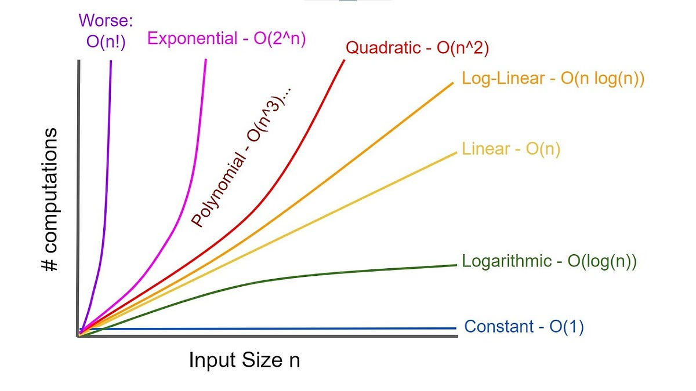

## Intro
The first thing I’m tackling is Big O, because without it, everything else in DSA just sounds like noise.

If you don’t understand how algorithms scale, you’re basically coding blind, things might work… until they don’t.

## What is Big O?
Big O describes how an algorithm behaves as the input size grows.

It’s not an exact measurement of time or memory.
It doesn’t tell you “this takes 3ms”.

Instead, it answers:

> “What happens when this input becomes huge?”

It helps you understand how your algorithm’s time or space requirements grow.

## Example O(n): 
```js title="O(n).js"
function printNumbers(n) {
  for (let i = 0; i < n; i++) {
    console.log(i);
  }
}
```
If `n = 10`, it runs 10 times.
If `n = 1,000,000`, it runs 1,000,000 times.

Growth is linear → O(n).

How can we tell?
Look for loops.
- 1 loop → usually O(n)
- Nested loops → usually O(n²)
- No loops → maybe O(1)

## Core Concepts
1. Growth depends on input

Big O is always about how things scale, not exact performance.


2. Drop constants
```js
function example(n) {
	for (let i = 0; i < n; i++) {
		console.log(i);
	}

	for (let i = 0; i < n; i++) {
		console.log(i);
	}
}
```
This is technically 2n, but we simplify it to O(n)

Why? Because when `n = 1,000,000` , whether it's `n` or `2n` doesn’t matter as much as how it grows.


3. Worst case matters

We usually analyze the worst-case scenario.

Example: searching in an array

Worst case → element is at the end → O(n)
	
## Practice vs Theory
Here’s where things get interesting.

You might think:

> “O(n log n) is always better than O(n²)”

But not always.

For small datasets, something like Insertion Sort (O(n²)) can actually be faster than Quick Sort (O(n log n)).

Why? 
- Less overhead
- Better cache behavior
- Simpler operations
Big O describes scaling, not real-world performance in all cases.

## Why use Big O
Because it helps you:
- Choose the right algorithm
- Choose the right data structure
- Avoid performance disasters
- Think like an engineer, not just a coder

## Types of Big O


- O(1) — Constant Time
  - Always the same, no matter input size. 
  - Example: `arr[0]`.
- O(log n) — Logarithmic Time
  - Input gets cut in half each step. 
  - Example: Binary Search 
- O(n) — Linear Time
  - Grows directly with input.
  - Example: `for (let i = 0; i < n; i++) {}`
- O(n log n) — Linearithmic Time
  - Common in efficient sorting algorithms.
  - Example: Merge Sort, Quick Sort (average case).
- O(n²) — Quadratic Time
  - Usually nested loops.
  - ```js 
        for (let i = 0; i < n; i++) {
            for (let j = 0; j < n; j++) {}
        }
- O(2ⁿ) — Exponential Time
  - Each step doubles the work.
  - Example: naive recursion (Fibonacci)
- O(n!) — Factorial Time
  - Brutal. Completely impractical for large inputs. Used with super computers.
  - Example: permutations.

 

